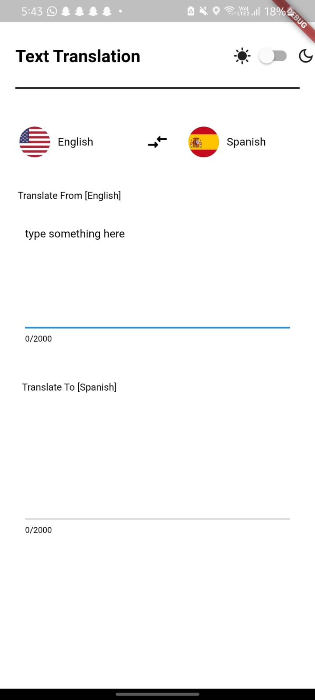
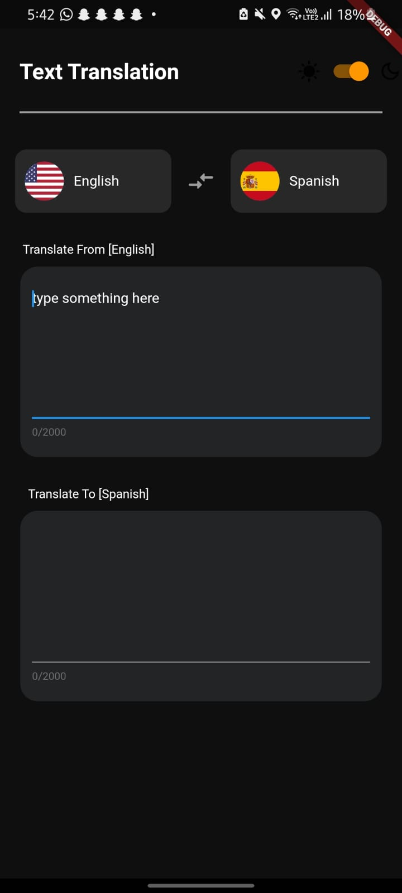
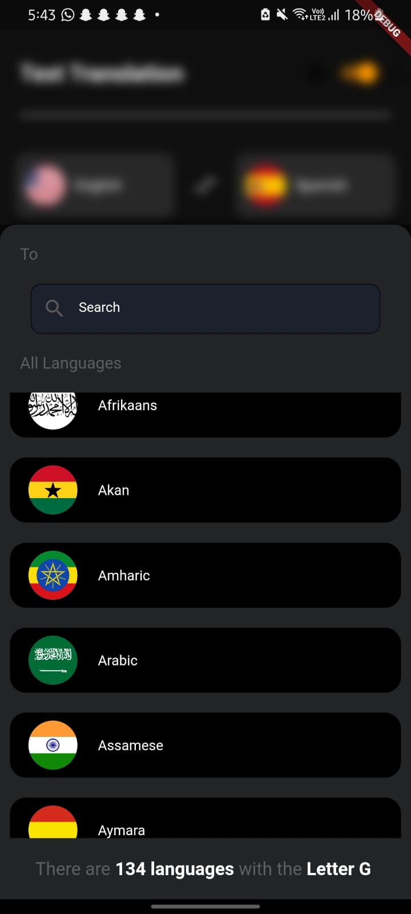

# Translator App
## translator application build using flutter 

# Screenshot
                       


## there are several bottle neck in appilcation due to less time spent on building its not focused 
## surely will fix in next update. 

# also paste your rapid api key here in apis.dart 


```final response = await dio.post(
    url.toString(),
    options: Options(
      headers: {
        'Content-Type': 'application/x-www-form-urlencoded',
'X-RapidAPI-Key': 'your api key here',
        'X-RapidAPI-Host': 'google-translate1.p.rapidapi.com'
      },```
